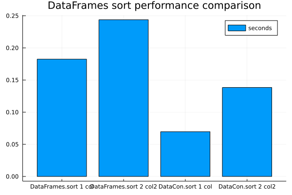

# DataConvenience

An eclectic collection of convenience functions for your data manipulation needs.

## Data

### Sampling with `sample`

You can conveniently sample a dataframe with the `sample` method

```
df = DataFrame(a=1:10)

# sample 10 rows
sample(df, 10)
```

```
# sample 10% of rows
sample(df, 0.1)
```

```
# sample 1/10 of rows
sample(df, 1//10)
```

### Faster sorting for DataFrames

You can sort `DataFrame`s (in ascending order only) faster than the `sort` function by using the `fsort` function. E.g.

```julia
using DataConvenience
using DataFrames
df = DataFrame(col = rand(1_000_000), col1 = rand(1_000_000), col2 = rand(1_000_000))

fsort(df, :col) # sort by `:col`
fsort(df, [:col1, :col2]) # sort by `:col1` and `:col2`
fsort!(df, :col) # sort by `:col` # sort in-place by `:col`
fsort!(df, [:col1, :col2]) # sort in-place by `:col1` and `:col2`
```

```
1000000×3 DataFrame
     Row │ col       col1        col2
         │ Float64   Float64     Float64
─────────┼─────────────────────────────────
       1 │ 0.95298   2.40468e-8  0.274197
       2 │ 0.100822  5.43567e-7  0.764761
       3 │ 0.445557  9.55935e-7  0.263688
       4 │ 0.136386  2.60883e-6  0.659607
       5 │ 0.568898  2.66762e-6  0.77789
       6 │ 0.666694  2.71565e-6  0.838029
       7 │ 0.311161  3.46322e-6  0.774721
       8 │ 0.743033  3.56981e-6  0.979397
    ⋮    │    ⋮          ⋮           ⋮
  999994 │ 0.33961   0.999993    0.503673
  999995 │ 0.907282  0.999996    0.264907
  999996 │ 0.69553   0.999996    0.295978
  999997 │ 0.419872  0.999996    0.48607
  999998 │ 0.154967  0.999998    0.0984277
  999999 │ 0.536315  0.999999    0.217873
 1000000 │ 0.859866  0.999999    0.117873
                        999985 rows omitted
```


```julia
df = DataFrame(col = rand(1_000_000), col1 = rand(1_000_000), col2 = rand(1_000_000))

using BenchmarkTools
fsort_1col = @belapsed fsort($df, :col) # sort by `:col`
fsort_2col = @belapsed fsort($df, [:col1, :col2]) # sort by `:col1` and `:col2`

sort_1col = @belapsed sort($df, :col) # sort by `:col`
sort_2col = @belapsed sort($df, [:col1, :col2]) # sort by `:col1` and `:col2`

using Plots
bar(["DataFrames.sort 1 col","DataFrames.sort 2 col2", "DataCon.sort 1 col","DataCon.sort 2 col2"],
    [sort_1col, sort_2col, fsort_1col, fsort_2col],
    title="DataFrames sort performance comparison",
    label = "seconds")
```




### Clean column names with `cleannames!`
Somewhat similiar to R's `janitor::clean_names` so that `cleannames!(df)` cleans the names of a `DataFrame`.

### One hot encoding

```
a = DataFrame(
  player1 = ["a", "b", "c"],
  player2 = ["d", "c", "a"]
)

# does not modify a
onehot(a, :player1)

# modfies a
onehot!(a, :player1)
```


### CSV Chunk Reader

You can read a CSV in chunks and apply logic to each chunk. The types of each column is inferred by `CSV.read`.

```julia
using DataFrames
using CSV

df = DataFrame(a = rand(1_000_000), b = rand(Int8, 1_000_000), c = rand(Int8, 1_000_000))

filepath = tempname()*".csv"
CSV.write(filepath, df)

for chunk in CsvChunkIterator(filepath)
  print(describe(chunk))
end
```

```
3×7 DataFrame
 Row │ variable  mean       min            median     max         nmissing 
 eltype
     │ Symbol    Float64    Real           Float64    Real        Int64    
 DataType
─────┼─────────────────────────────────────────────────────────────────────
──────────
   1 │ a          0.500244     1.37953e-6   0.500304    0.999999         0 
 Float64
   2 │ b         -0.509408  -128           -1.0       127                0 
 Int64
   3 │ c         -0.587495  -128           -1.0       127                0 
 Int64
```


The chunk iterator uses `CSV.read` parameters. The user can pass in `type` and `types` to dictate the types of each column e.g.

```julia
# read all column as String
for chunk in CsvChunkIterator(filepath, type=String)
    print(describe(chunk))
end
```

```
3×7 DataFrame
 Row │ variable  mean     min                    median   max              
     nmissing  eltype
     │ Symbol    Nothing  String                 Nothing  String           
     Int64     DataType
─────┼─────────────────────────────────────────────────────────────────────
────────────────────────
   1 │ a                  0.0001000242096453885           9.918498010730303
e-5         0  String
   2 │ b                  -1                              99               
            0  String
   3 │ c                  -1                              99               
            0  String
```


```julia
# read a three colunms csv where the column types are String, Int, Float32
for chunk in CsvChunkIterator(filepath, types=[String, Int, Float32])
  print(describe(chunk))
end
```

```
3×7 DataFrame
 Row │ variable  mean       min                    median  max             
      nmissing  eltype
     │ Symbol    Union…     Any                    Union…  Any             
      Int64     DataType
─────┼─────────────────────────────────────────────────────────────────────
─────────────────────────
   1 │ a                    0.0001000242096453885          9.91849801073030
3e-5         0  String
   2 │ b         -0.509408  -128                   -1.0    127             
             0  Int64
   3 │ c         -0.587495  -128.0                 -1.0    127.0           
             0  Float32
```


**Note** The chunks MAY have different column types.

## Statistics & Correlations

### Canonical Correlation
The first component of Canonical Correlation.

```
x = rand(100, 5)
y = rand(100, 5)

canonicalcor(x, y)
```

### Correlation for `Bool`
`cor(x::Bool, y)` -  allow you to treat `Bool` as 0/1 when computing correlation

### Correlation for `DataFrames`
`dfcor(df::AbstractDataFrame, cols1=names(df), cols2=names(df), verbose=false)`

Compute correlation in a DataFrames by specifying a set of columns `cols1` vs
another set `cols2`. The cartesian product of `cols1` and `cols2`'s correlation
will be computed

## Miscellaneous

### `@replicate`
`@replicate code times` will run `code` multiple times e.g.

```julia
@replicate 10 8
```

```
10-element Vector{Int64}:
 8
 8
 8
 8
 8
 8
 8
 8
 8
 8
```


### StringVector
`StringVector(v::CategoricalVector{String})` - Convert `v::CategoricalVector` efficiently to `WeakRefStrings.StringVector`

### Faster count missing

There is a `count_missisng` function

```julia
x = Vector{Union{Missing, Int}}(undef, 10_000_000)

cmx = count_missing(x) # this is faster

cmx2 = countmissing(x) # this is faster

cimx = count(ismissing, x) # the way available at base


cmx == cimx # true
```

```
true
```


There is also the `count_non_missisng` function and `countnonmissing` is its synonym.
