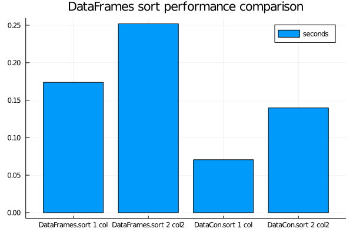

# DataConvenience

An eclectic collection of convenience functions for your data manipulation needs.

## Data

### Piping Convenience

#### Defining `filter(::AbstractDataFrame, arg)`
DataFrames.jl does not define `filter(::AbstractDataFrame, arg)` and instead has `filter(arg, ::AbstractDataFrame)` only. This makes it inconsistent with the other functions so that's why I am defining `filter` with the signature `filter(::AbstractDataFrame, arg)`.

#### Examples
```julia
using DataConvenience
using DataFrames
using Chain: @chain

df = DataFrame(a=1:8)

@chain df begin
    filter(:a => ==(1))
end
```

```
1×1 DataFrame
 Row │ a
     │ Int64
─────┼───────
   1 │     1
```


Note: DataConvenience.jl used to re-export Lazy.jl's `@>` which it no longer does. Users are encouraged to use [Chain.jl](https://github.com/jkrumbiegel/Chain.jl) instead.

### Sampling with `sample`

You can conveniently sample a dataframe with the `sample` method

```
df = DataFrame(a=1:10)

# sample 10 rows
sample(df, 10)
```

```
# sample 10% of rows
sample(df, 0.1)
```

```
# sample 1/10 of rows
sample(df, 1//10)
```

### Faster sorting for DataFrames

You can sort `DataFrame`s (in ascending order only) faster than the `sort` function by using the `fsort` function. E.g.

```julia
using DataFrames
df = DataFrame(col = rand(1_000_000), col1 = rand(1_000_000), col2 = rand(1_000_000))

fsort(df, :col) # sort by `:col`
fsort(df, [:col1, :col2]) # sort by `:col1` and `:col2`
fsort!(df, :col) # sort by `:col` # sort in-place by `:col`
fsort!(df, [:col1, :col2]) # sort in-place by `:col1` and `:col2`
```

```
1000000×3 DataFrame
     Row │ col        col1        col2
         │ Float64    Float64     Float64
─────────┼──────────────────────────────────
       1 │ 0.561204   7.28226e-7  0.364491
       2 │ 0.552371   1.55213e-6  0.449652
       3 │ 0.995762   2.64605e-6  0.024013
       4 │ 0.601954   3.16072e-6  0.743319
       5 │ 0.932321   6.11559e-6  0.190004
       6 │ 0.147286   6.73857e-6  0.0394049
       7 │ 0.722439   8.40162e-6  0.0565526
       8 │ 0.358826   8.62958e-6  0.788989
    ⋮    │     ⋮          ⋮           ⋮
  999994 │ 0.79161    0.999993    0.312891
  999995 │ 0.779757   0.999996    0.0197649
  999996 │ 0.681739   0.999997    0.0685774
  999997 │ 0.736364   0.999997    0.15211
  999998 │ 0.259878   0.999997    0.480823
  999999 │ 0.943275   0.999998    0.96846
 1000000 │ 0.837561   0.999999    0.289213
                         999985 rows omitted
```


```julia
df = DataFrame(col = rand(1_000_000), col1 = rand(1_000_000), col2 = rand(1_000_000))

using BenchmarkTools
fsort_1col = @belapsed fsort($df, :col) # sort by `:col`
fsort_2col = @belapsed fsort($df, [:col1, :col2]) # sort by `:col1` and `:col2`

sort_1col = @belapsed sort($df, :col) # sort by `:col`
sort_2col = @belapsed sort($df, [:col1, :col2]) # sort by `:col1` and `:col2`

using Plots
bar(["DataFrames.sort 1 col","DataFrames.sort 2 col2", "DataCon.sort 1 col","DataCon.sort 2 col2"],
    [sort_1col, sort_2col, fsort_1col, fsort_2col],
    title="DataFrames sort performance comparison",
    label = "seconds")
```




### Clean column names with `cleannames!`
Somewhat similiar to R's `janitor::clean_names` so that `cleannames!(df)` cleans the names of a `DataFrame`.


### CSV Chunk Reader

You can read a CSV in chunks and apply logic to each chunk. The types of each column is inferred by `CSV.read`.

```julia
using DataFrames
using CSV

df = DataFrame(a = rand(1_000_000), b = rand(Int8, 1_000_000), c = rand(Int8, 1_000_000))

filepath = tempname()*".csv"
CSV.write(filepath, df)

for chunk in CsvChunkIterator(filepath)
  print(describe(chunk))
end
```

```
3×7 DataFrame
 Row │ variable  mean       min            median     max    nmissing  elty
pe
     │ Symbol    Float64    Real           Float64    Real   Int64     Data
Type
─────┼─────────────────────────────────────────────────────────────────────
─────
   1 │ a          0.499336     1.48721e-6   0.499138    1.0         0  Floa
t64
   2 │ b         -0.495945  -128            0.0       127           0  Int6
4
   3 │ c         -0.574404  -128           -1.0       127           0  Int6
4
```


The chunk iterator uses `CSV.read` parameters. The user can pass in `type` and `types` to dictate the types of each column e.g.

```julia
# read all column as String
for chunk in CsvChunkIterator(filepath, type=String)
    print(describe(chunk))
end
```

```
3×7 DataFrame
 Row │ variable  mean     min                     median   max             
      nmissing  eltype
     │ Symbol    Nothing  String                  Nothing  String          
      Int64     DataType
─────┼─────────────────────────────────────────────────────────────────────
─────────────────────────
   1 │ a                  0.00010077562806376505           9.79725879761694
8e-5         0  String
   2 │ b                  -1                               99              
             0  String
   3 │ c                  -1                               99              
             0  String
```


```julia
# read a three colunms csv where the column types are String, Int, Float32
for chunk in CsvChunkIterator(filepath, types=[String, Int, Float32])
  print(describe(chunk))
end
```

```
3×7 DataFrame
 Row │ variable  mean       min                     median  max            
       nmissing  eltype
     │ Symbol    Union…     Any                     Union…  Any            
       Int64     DataType
─────┼─────────────────────────────────────────────────────────────────────
──────────────────────────
   1 │ a                    0.00010077562806376505          9.7972587976169
48e-5         0  String
   2 │ b         -0.495945  -128                    0.0     127            
              0  Int64
   3 │ c         -0.574404  -128.0                  -1.0    127.0          
              0  Float32
```


**Note** The chunks MAY have different column types.

## Statistics & Correlations

### Canonical Correlation
The first component of Canonical Correlation.

```
x = rand(100, 5)
y = rand(100, 5)

canonicalcor(x, y)
```

### Correlation for `Bool`
`cor(x::Bool, y)` -  allow you to treat `Bool` as 0/1 when computing correlation

### Correlation for `DataFrames`
`dfcor(df::AbstractDataFrame, cols1=names(df), cols2=names(df), verbose=false)`

Compute correlation in a DataFrames by specifying a set of columns `cols1` vs
another set `cols2`. The cartesian product of `cols1` and `cols2`'s correlation
will be computed

## Miscellaneous

### `@replicate`
`@replicate code times` will run `code` multiple times e.g.

```julia
@replicate 10 8
```

```
10-element Vector{Int64}:
 8
 8
 8
 8
 8
 8
 8
 8
 8
 8
```


### StringVector
`StringVector(v::CategoricalVector{String})` - Convert `v::CategoricalVector` efficiently to `WeakRefStrings.StringVector`

### Faster count missing

There is a `count_missisng` function

```julia
x = Vector{Union{Missing, Int}}(undef, 10_000_000)

cmx = count_missing(x) # this is faster

cmx2 = countmissing(x) # this is faster

cimx = count(ismissing, x) # the way available at base


cmx == cimx # true
```

```
true
```


There is also the `count_non_missisng` function and `countnonmissing` is its synonym.
